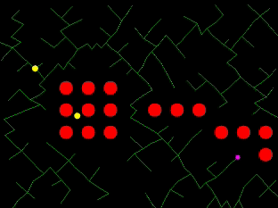
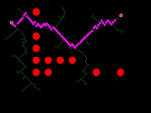

# Rapidly-Exploring Random Tree (RRT)

### About

Path-planning is a resource-intensive task for robots / UAVs. The RRT algorithm provides [1] a way to solve this problem. The implementation is simple (see also [2]), but it comes with a cost...the path generated from the starting point till the goal is not optimal, usually post-processing is required.

<p align="center"> 
</a>
</a>
</p>

Red dots - obstacles; Yellow dots - start/goal point locations; Pink dots - generated path. 

### How to use

The RTT class has the following parameter on instantiation:

```
STATE_SPACE - define the limits of the search area;
GOAL_STOP_RADIUS - distance to stop, nearby the goal;
LINE_SIZE - length of exploring line (lover values => higher precision => higher resource consumption);
COLL_DIST - safe distance, to avoid collisions with obstacles;
MAP - numpy array [n,2] array, holds the obstacles;
```
Execute the 'test_rrt.py' to see the RRT in action.


## Resources

1. [Rapidly-Exploring Random Tree](https://en.wikipedia.org/wiki/Rapidly-exploring_random_tree)
2. [simpleAstar](https://github.com/fvilmos/simpleAstar)

/Enjoy
